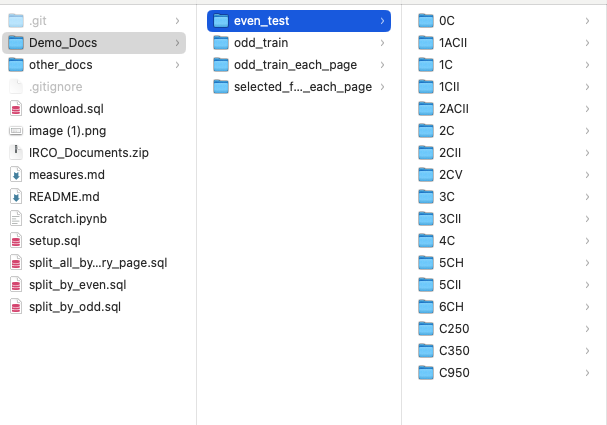
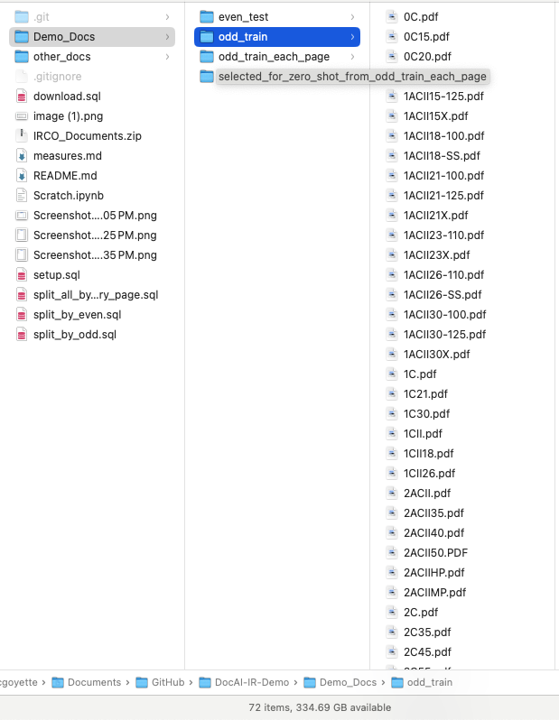
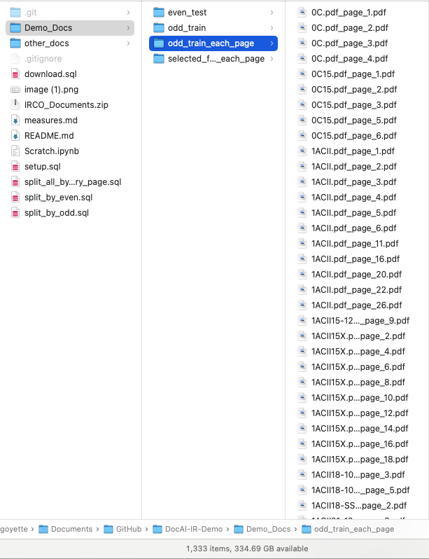

# DocAI-IR-Demo
Demonstration of document parsing, ingestion, and processing with DocAI in Snowflake

## Notes on Build Sheet measures, for DocAI dev

###  Desired measures:
- ~ rotor_assembly (input)
- ~ diffuser_assembly (input)
- focal_file / aero file (target)

Rotor assembly and usually Diffuser assembly values are usually known up front, and will be used as lookup keys. 
The Goal is to find the focal file id.

#### Notes:
- 'Aero File' the same as 'Focal File'? Yes.
  - e.g., C950, C350 dirs

## Pre-processing Documents
In some cases documents need to be split before processing. For example, if you have merged documents such as scans and need to ask the question sets against individual pages, you will first need to split out the pages before processing them with Document AI. 

There are three stored procedure definitions in this repo, for demonstration purposes. These are likely to be modified further for your purposes.

 **Note: For the POC activity, I used the first UDF to split PDFs into single page PDFs.**   
Odd/even blank pages distinction is ignored, for now, to reduce complexity / not introduce additional factors in the experiment. Observe realized performance on single-page-only approach. 

#### Example: Split document pages every page
Converts multi-page PDFs into single page PDFs with page number addendum
- Split every PDF in stage into single page PDFs: [split_by_each_page](split_all_by_every_page.sql)
- make sure have the database, schema and origin and destination stages created

#### Example: Split document pages by odd numbers
When documents are blank every even page / only contain pages with relevant content on every odd page
- Split odd pages <Note: currently 1:1 only; does not crawl stage for all docs> : [split_by_odd](split_by_odd.sql)
- make sure have the database, schema and origin and destination stages created

#### Example: Split document pages by even numbers
When documents are blank every odd page / only contain pages with relevant content on every even page
- Split even pages <Note: currently 1:1 only; does not crawl stage for all docs> : [split_by_even](split_by_even.sql)
- make sure have the database, schema and origin and destination stages created

## Selecting training data
**TL;DR use your best judgement to randomly select training examples from a representative sample of data.**

The original approach was to select 50% of documents in Build Books dir for training & fine tuning, via the following (manual) method:
- Sort by name
  - Select every other document in directory
  - Intention here is to capture a representative sample of Build Books across products

However, splitting up these documents into single page documents produced far more training data (>1300 single page PDFs) than was required. 

To downsample, I then (semi-randomly) selected the first 4-5 single page PDFs for each product models I observed. Reasoning being that the different models have different document formats. I did not inspect individual files before selecting them; reasoning here, being that I did not want to bias training routines with, say, excluding documents which had handwriting. 

I have included a screenshot in this repo, of the directory I used for training, highlighting
1. "Test data" remaining in original directory structure (~70 docs)

2. "Training data" having been moved into a single directory (72 docs)

3. Post-process data (multi page to single page) downloaded using REST API (~1300 documents)

4. Pseudo-random selection of documents for training & validation, from (3) (~100 documents)


## Document AI
Public Documentation, overview: (https://docs.snowflake.com/en/user-guide/snowflake-cortex/document-ai/overview)

The core workflow is as follows: 
1. SQL: Set up required objects & privileges
2. SQL and/or Python SPROCs: Prepare documents (optional, use-case-specific)
  a. Note: See example snippet below for REST API call to download files in bulk, from stage
3. [Snowsight: Create new Document AI model Build](https://docs.snowflake.com/en/user-guide/snowflake-cortex/document-ai/prepare-model-build#create-a-document-ai-model-build)
  a. Upload prepared documents
  b. Snowsight: Annotate documents
  c. define measures
  d. observe zero-shot results. Note: recommend reviewing at least 20 documents before Training (fine tuning)
5. Snowsight: Publish first model version OR fine tune (Train)
  a. [Recommendations/guidelines for training time](https://docs.snowflake.com/en/user-guide/snowflake-cortex/document-ai/prepare-model-build#training-time-estimation) 
6. Iterate to satisfactory performance
7. Use published model to infer results on unseen documents

## SQL snippets, utilities 

#### Snippet: Using REST API to download files from stage
Download all files in the stage for the mytable table to the /tmp/data local directory (in a Linux or macOS environment): 
* ```GET @%mytable file:///tmp/data/;```

Ref: https://docs.snowflake.com/en/sql-reference/sql/get#examples

### Inference 
#### Snippet: Run predict function with JSON and Directory information in the output

```sql
SELECT 
Relative_path as file_name --https://docs.snowflake.com/en/user-guide/data-load-dirtables-query
, size as file_size
, last_modified
, file_url as snowflake_file_url
, NIKOLAI_MANUAL_TEST!predict(get_presigned_url('@NIKOLAI_TEST_STAGE', RELATIVE_PATH ), 1) as json
from directory(@NIKOLAI_TEST_STAGE)
```

### Model Management 
#### Snippet: See every created Document AI Model Build
```sql
SHOW INSTANCES OF CLASS SNOWFLAKE.ML.DOCUMENT_INTELLIGENCE;
```

#### Snippet: Delete a specific Document AI Model Build
```sql
DROP INSTANCE NIKOLAI_SNOWFLAKE_TS;
```

### Topic: Post-Processing 
#### Managing Document AI JSON outputs
1. Create flattened table with a list as an array
2. Create flattened table with a list flattened
3. Restructure tables using a number of lists
4. Transform and Filter with JSON lists
5. Process all documents within a stage and batch the operation by up to 1000 document every batch
6. Process all documents within a stage through a task which checks the resulting table to avoid duplications

#### 1. Create flattened table with list in array

```sql
-- materialize the table with the JSON already unnested (2 options as there are different ways to handle list outputs)
CREATE OR REPLACE TABLE doc_ai_ns.doc_ai_ns.manuals_test_2 AS (
WITH temp as(
SELECT 
Relative_path as file_name --https://docs.snowflake.com/en/user-guide/data-load-dirtables-query
, size as file_size
, last_modified
, file_url as snowflake_file_url
, NIKOLAI_MANUAL_TEST!predict(get_presigned_url('@NIKOLAI_TEST_STAGE', RELATIVE_PATH ), 1) as json
from directory(@NIKOLAI_TEST_STAGE)
)

SELECT
file_name
, file_size
, last_modified
, snowflake_file_url
, json:__documentMetadata.ocrScore::FLOAT AS ocrScore
, f.value:score::FLOAT AS inspection_date_score
, f.value:value::STRING AS inspection_date_value
, g.value:score::FLOAT AS inspection_grade_score
, g.value:value::STRING AS inspection_grade_value
, h.value:score::FLOAT AS inspection_recommendation_score
, h.value:value::STRING AS inspection_recommendation_value
, i.value:score::FLOAT AS inspector_score
, i.value:value::STRING AS inspector_value
, ARRAY_TO_STRING(ARRAY_AGG(j.value:value::STRING), ', ') AS list_of_units --if you want to comma delimit the list
FROM doc_ai_ns.doc_ai_ns.manuals_test_table
, LATERAL FLATTEN(input => json:inspection_date) f
, LATERAL FLATTEN(input => json:inspection_grade) g
, LATERAL FLATTEN(input => json:inspection_recommendation) h
, LATERAL FLATTEN(input => json:inspector) i
, LATERAL FLATTEN(input => json:list_of_units) j --if you want to comma delimit the list
GROUP BY ALL
;
```

#### 2. Create flattened table with a list flattened out

```sql
-- materialize the table with the JSON already unnested (2 options as there are different ways to handle list outputs)
CREATE OR REPLACE TABLE doc_ai_ns.doc_ai_ns.manuals_test_2 AS (
WITH temp as(
SELECT 
Relative_path as file_name --https://docs.snowflake.com/en/user-guide/data-load-dirtables-query
, size as file_size
, last_modified
, file_url as snowflake_file_url
, NIKOLAI_MANUAL_TEST!predict(get_presigned_url('@NIKOLAI_TEST_STAGE', RELATIVE_PATH ), 1) as json
from directory(@NIKOLAI_TEST_STAGE)
)

, first_flatten AS (
SELECT
file_name
, file_size
, last_modified
, snowflake_file_url
, json:__documentMetadata.ocrScore::FLOAT AS ocrScore
, f.value:score::FLOAT AS inspection_date_score
, f.value:value::STRING AS inspection_date_value
, g.value:score::FLOAT AS inspection_grade_score
, g.value:value::STRING AS inspection_grade_value
, h.value:score::FLOAT AS inspection_recommendation_score
, h.value:value::STRING AS inspection_recommendation_value
, i.value:score::FLOAT AS inspector_score
, i.value:value::STRING AS inspector_value
, ARRAY_TO_STRING(ARRAY_AGG(j.value:value::STRING), ', ') AS list_of_units --if you want to comma delimit the list
FROM doc_ai_ns.doc_ai_ns.manuals_test_table
, LATERAL FLATTEN(input => json:inspection_date) f
, LATERAL FLATTEN(input => json:inspection_grade) g
, LATERAL FLATTEN(input => json:inspection_recommendation) h
, LATERAL FLATTEN(input => json:inspector) i
GROUP BY ALL
)

, second_flatten AS ( 
SELECT 
file_name
, j.value:score::FLOAT AS unit_score
, j.value:value::STRING AS unit_value
FROM temp
, LATERAL FLATTEN(input => json:list_of_units) j
)

SELECT 
a.*
, b.unit_score
, b.unit_value
FROM first_flatten a
LEFT JOIN second_flatten b ON a.file_name = b.file_name
)
;
```

#### 3. Restructure tables using a number of lists

```sql
CREATE TABLE doc_ai_ns.doc_ai_ns.test_table_2 (
    result VARIANT
);


INSERT INTO doc_ai_ns.doc_ai_ns.test_table_2 (result)
SELECT PARSE_JSON('{
  "order_number": [
    {
      "score": 1,
      "value": "0067891"
    },
    {
      "score": 1,
      "value": "0067892"
    },
    {
      "score": 1,
      "value": "0067893"
    },
    {
      "score": 1,
      "value": "0067894"
    }
  ],
  "company": [
    {
      "score": 1,
      "value": "TECH SOLUTIONS INC"
    }
  ],
  "due_date": [
    {
      "score": 0.98,
      "value": "September 15, 2024"
    }
  ],
  "list_number": [
    {
      "score": 1,
      "value": "2024 NS 004567"
    }
  ],
  "item_codes": [
    {
      "score": 1,
      "value": "X123"
    },
    {
      "score": 1,
      "value": "X456"
    },
    {
      "score": 1,
      "value": "X789"
    },
    {
      "score": 1,
      "value": "X012"
    }
  ],
  "supplier": [
    {
      "score": 1,
      "value": "GLOBAL SUPPLY CO."
    }
  ],
  "cost": [
    {
      "score": 1,
      "value": "250.50"
    },
    {
      "score": 1,
      "value": "350.75"
    },
    {
      "score": 1,
      "value": "150.20"
    },
    {
      "score": 1,
      "value": "450.99"
    }
  ],
  "total_due": [
    {
      "score": 1,
      "value": "1,202.44"
    }
  ],
  "city_name": [
    {
      "score": 1,
      "value": "San Francisco"
    }
  ],
  "inventory_number": [
    {
      "score": 0.995,
      "value": "1HGBH41JXMN109186"
    },
    {
      "score": 0.995,
      "value": "1HGBH41JXMN109187"
    },
    {
      "score": 0.995,
      "value": "1HGBH41JXMN109188"
    },
    {
      "score": 0.995,
      "value": "1HGBH41JXMN109189"
    }
  ],
  "__documentMetadata": {
    "ocrScore": 0.921
  }
}');

WITH
-- Extract multi-value lists
  order_number AS (
    SELECT
      seq4() AS seq,
      value:value::STRING AS order_number
    FROM test_table_2
    , LATERAL FLATTEN(input => result:order_number) 
  ),

  item_codes AS (
    SELECT
      seq4() AS seq,
      value:value::STRING AS item_codes
    FROM test_table_2
    ,LATERAL FLATTEN(input => result:item_codes)
  ),

  cost AS (
    SELECT
      seq4() AS seq,
      value:value::STRING AS cost
    FROM test_table_2
    ,LATERAL FLATTEN(input => result:cost) 
  ),

  inventory_number AS (
    SELECT
      seq4() AS seq,
      value:value::STRING AS inventory_number
    FROM test_table_2
    ,LATERAL FLATTEN(input => result:inventory_number) 
  ),

  -- Extract single-value attributes 
  single_value_attributes AS (
    SELECT
      a.value:value::STRING AS company,
      b.value:value::STRING AS due_date,
      c.value:value::STRING AS list_Number,
      d.value:value::STRING AS supplier,
      e.value:value::STRING AS total_Due,
      f.value:value::STRING AS City_Name
    FROM test_table_2
    , LATERAL FLATTEN(input => result:company) a
    , LATERAL FLATTEN(input => result:due_date) b
    , LATERAL FLATTEN(input => result:list_number) c
    , LATERAL FLATTEN(input => result:supplier) d
    , LATERAL FLATTEN(input => result:total_due) e
    , LATERAL FLATTEN(input => result:city_name) f
  )

--merge
  SELECT
  b.order_number,
  s.company,
  s.due_date,
  s.list_number,
  r.item_codes,
  s.supplier,
  t.cost,
  s.total_due,
  s.city_name,
  v.inventory_number
FROM
  order_number b
  LEFT JOIN item_codes r ON b.seq = r.seq
  LEFT JOIN cost t ON b.seq = t.seq
  LEFT JOIN inventory_number v ON b.seq = v.seq
  CROSS JOIN single_value_attributes s
ORDER BY
  b.seq;
;
```

#### 4. Transform and Filter with JSON lists
- Higher Order Functions https://medium.com/snowflake/snowflake-supports-higher-order-functions-dfa4b7682f7a 
- TRANSFORM - https://docs.snowflake.com/en/sql-reference/functions/transform 
- FILTER - https://docs.snowflake.com/en/sql-reference/functions/filter 

#### 5. Process all documents within a stage and batch the operation by up to 1000 document every batch

```sql
CREATE OR REPLACE PROCEDURE batch_prediction(model_name VARCHAR, model_version INTEGER, stage_name VARCHAR, result_table_name VARCHAR, batch_size INTEGER)
RETURNS TABLE(file_name VARCHAR(100), prediction VARCHAR)
LANGUAGE SQL
AS
  DECLARE
    maximum_count_query VARCHAR DEFAULT 'select COUNT(distinct metadata$filename) as no from @' || :stage_name;
    maximum_count RESULTSET;
    res RESULTSET;
    stage_size INTEGER;
    i INTEGER DEFAULT 0;
    presigned_url_table_name VARCHAR DEFAULT 'presigned_urls_' || (SELECT randstr(15, random()));
    query_create_table VARCHAR DEFAULT 'create or replace table ' || :result_table_name || '(file_name VARCHAR(100), prediction VARCHAR)';
    query_create_presigned VARCHAR;
    query_insert VARCHAR DEFAULT 'insert into ' || :result_table_name || '(file_name, prediction) select file_name, ' || :model_name || '!predict(presigned_url, ' || :model_version || ') from ' || :presigned_url_table_name;
    query_result VARCHAR DEFAULT 'select * from ' || :result_table_name;
  BEGIN
    res := (EXECUTE IMMEDIATE :query_create_table);
    maximum_count := (EXECUTE IMMEDIATE :maximum_count_query);
    FOR j IN maximum_count DO
      stage_size := j.no;
      WHILE (i < stage_size) DO
        query_create_presigned := 'create or replace temporary table ' || :presigned_url_table_name || '(file_name, presigned_url) as select distinct split_part(metadata$filename, \'/\',-1) as fn, get_presigned_url(@' || :stage_name || ', fn) from @' || :stage_name || ' limit ' || :batch_size || 'offset ' || i;
        res := (EXECUTE IMMEDIATE :query_create_presigned);
        res := (EXECUTE IMMEDIATE :query_insert);
        i := i + :batch_size;
      END WHILE;
    END FOR;
    res := (EXECUTE IMMEDIATE :query_result);
    RETURN TABLE(res);
  END;
```

```
CALL batch_prediction('NIKOLAI_CONTRACT_TEST', 2, 'CONTRACTS_TEST', 'contract_test_2', 20);
```

#### 6. Process all documents within a stage through a task which checks the resulting table to avoid duplications

```sql
-- create the output table, important part is to have the `relative_path` there
create table if not exists stage_results(relative_path varchar, res varchar);

--create the task
CREATE OR REPLACE TASK process_from_stage
  WAREHOUSE = WH1
  SCHEDULE = '1 minute'
  COMMENT = 'Process the next chuck of files from the stage'
AS
INSERT INTO stage_results (
  SELECT
    RELATIVE_PATH,
    -- use your build name and stage
    BF_NOPUB!PREDICT(GET_PRESIGNED_URL(@db1.schema1.PERF_100, relative_path)) as res  
  FROM 
    -- use your stage
    DIRECTORY(@db1.schema1.PERF_100)
  WHERE 
     RELATIVE_PATH not in (
       select RELATIVE_PATH from stage_results
     ) 
  ORDER BY LAST_MODIFIED ASC  
  -- the current max limit is 20
  -- keep in mind that the default limit for TASK execution is 1 hour only!
  LIMIT 20
); 
```
